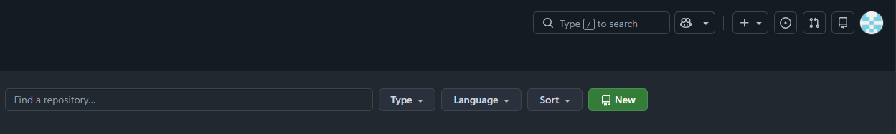
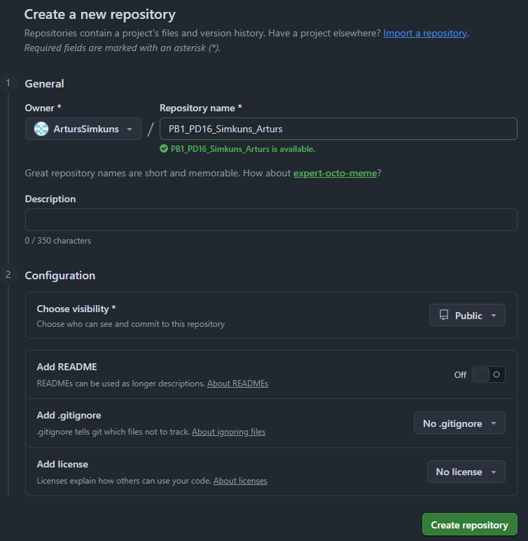
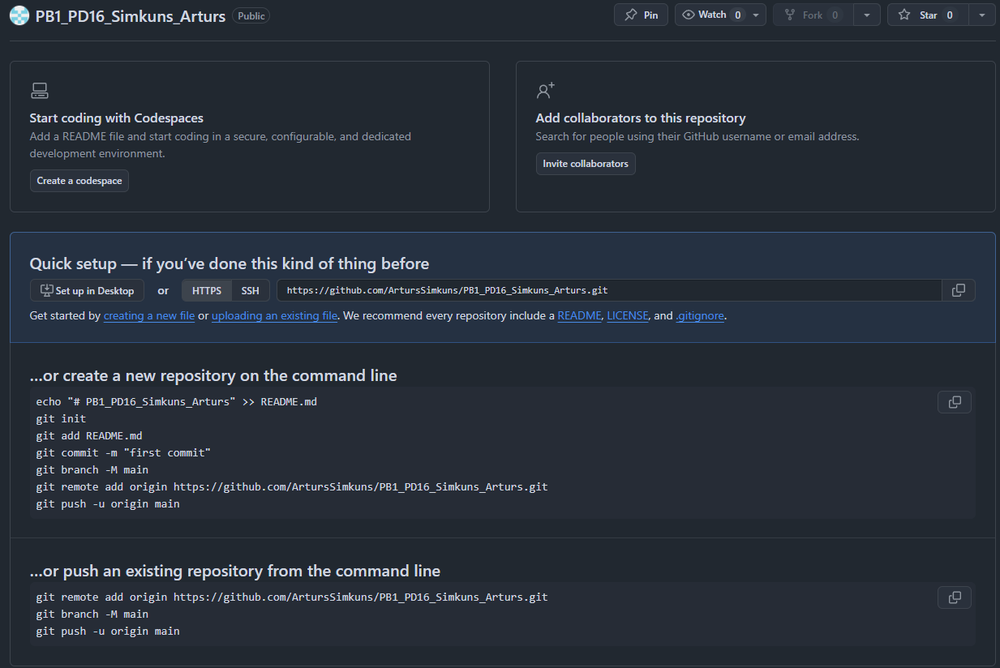

2. Git inicializācija

```bash
PS C:\Users\robo\Documents\BUTS\Praktiskie_darbi\05 Programmas koda rakstīšana (Kodēšana)\PB1_PD16 Versiju kontrole\PB1_PD16_Simkuns_Arturs> git init
Initialized empty Git repository in C:/Users/robo/Documents/BUTS/Praktiskie_darbi/05 Programmas koda rakstīšana (Kodēšana)/PB1_PD16 Versiju kontrole/PB1_PD16_Simkuns_Arturs/.git/
PS C:\Users\robo\Documents\BUTS\Praktiskie_darbi\05 Programmas koda rakstīšana (Kodēšana)\PB1_PD16 Versiju kontrole\PB1_PD16_Simkuns_Arturs> git status
On branch master

No commits yet

Untracked files:
  (use "git add <file>..." to include in what will be committed)
        .gitignore
        README.md
        projekts.py

nothing added to commit but untracked files present (use "git add" to track)
```

mapes struktūra pēc komandas `git init` izpildes:
```powershell
PS C:\Users\robo\Documents\BUTS\Praktiskie_darbi\05 Programmas koda rakstīšana (Kodēšana)\PB1_PD16 Versiju kontrole\PB1_PD16_Simkuns_Arturs> Show-Tree .
PB1_PD16_Simkuns_Arturs/
├── .git/
│   ├── hooks/
│   │   ├── applypatch-msg.sample
│   │   ├── commit-msg.sample
│   │   ├── fsmonitor-watchman.sample
│   │   ├── post-update.sample
│   │   ├── pre-applypatch.sample
│   │   ├── pre-commit.sample
│   │   ├── pre-merge-commit.sample
│   │   ├── prepare-commit-msg.sample
│   │   ├── pre-push.sample
│   │   ├── pre-rebase.sample
│   │   ├── pre-receive.sample
│   │   ├── push-to-checkout.sample
│   │   ├── sendemail-validate.sample
│   │   └── update.sample
│   ├── info/
│   │   └── exclude
│   ├── objects/
│   │   ├── info/
│   │   └── pack/
│   ├── refs/
│   │   ├── heads/
│   │   └── tags/
│   ├── config
│   ├── description
│   └── HEAD
├── .gitignore
├── projekts.py
└── README.md
```

2.3 Git identitātes iestatīšana

```powershell
PS C:\Users\robo\Documents\BUTS\Praktiskie_darbi\05 Programmas koda rakstīšana (Kodēšana)\PB1_PD16 Versiju kontrole\PB1_PD16_Simkuns_Arturs> git config --global user.name "Artūrs Šimkūns"
PS C:\Users\robo\Documents\BUTS\Praktiskie_darbi\05 Programmas koda rakstīšana (Kodēšana)\PB1_PD16 Versiju kontrole\PB1_PD16_Simkuns_Arturs> git config --global user.email "arturs.simkuns@gmail.com"
PS C:\Users\robo\Documents\BUTS\Praktiskie_darbi\05 Programmas koda rakstīšana (Kodēšana)\PB1_PD16 Versiju kontrole\PB1_PD16_Simkuns_Arturs> git config --list
diff.astextplain.textconv=astextplain
filter.lfs.clean=git-lfs clean -- %f
filter.lfs.smudge=git-lfs smudge -- %f
filter.lfs.process=git-lfs filter-process
filter.lfs.required=true
http.sslbackend=schannel
core.autocrlf=true
core.fscache=true
core.symlinks=false
pull.rebase=false
credential.helper=manager
credential.https://dev.azure.com.usehttppath=true
init.defaultbranch=master
user.name=Artūrs Šimkūns
user.email=arturs.simkuns@gmail.com
core.repositoryformatversion=0
core.filemode=false
core.bare=false
core.logallrefupdates=true
core.symlinks=false
core.ignorecase=true
```

Lai redzētu, no kura faila nāk katrs iestatījums, izmanto:

```powershell
PS C:\Users\robo\Documents\BUTS\Praktiskie_darbi\05 Programmas koda rakstīšana (Kodēšana)\PB1_PD16 Versiju kontrole\PB1_PD16_Simkuns_Arturs> git config --list --show-origin
file:C:/Program Files/Git/etc/gitconfig diff.astextplain.textconv=astextplain
file:C:/Program Files/Git/etc/gitconfig filter.lfs.clean=git-lfs clean -- %f
file:C:/Program Files/Git/etc/gitconfig filter.lfs.smudge=git-lfs smudge -- %f
file:C:/Program Files/Git/etc/gitconfig filter.lfs.process=git-lfs filter-process
file:C:/Program Files/Git/etc/gitconfig filter.lfs.required=true
file:C:/Program Files/Git/etc/gitconfig http.sslbackend=schannel
file:C:/Program Files/Git/etc/gitconfig core.autocrlf=true
file:C:/Program Files/Git/etc/gitconfig core.fscache=true
file:C:/Program Files/Git/etc/gitconfig core.symlinks=false
file:C:/Program Files/Git/etc/gitconfig pull.rebase=false
file:C:/Program Files/Git/etc/gitconfig credential.helper=manager
file:C:/Program Files/Git/etc/gitconfig credential.https://dev.azure.com.usehttppath=true
file:C:/Program Files/Git/etc/gitconfig init.defaultbranch=master
file:C:/Users/robo/.gitconfig   user.name=Artūrs Šimkūns
file:C:/Users/robo/.gitconfig   user.email=arturs.simkuns@gmail.com
file:.git/config        core.repositoryformatversion=0
file:.git/config        core.filemode=false
file:.git/config        core.bare=false
file:.git/config        core.logallrefupdates=true
file:.git/config        core.symlinks=false
file:.git/config        core.ignorecase=true
```


3. Pirmais commit

```powershell
PS C:\Users\robo\Documents\BUTS\Praktiskie_darbi\05 Programmas koda rakstīšana (Kodēšana)\PB1_PD16 Versiju kontrole\PB1_PD16_Simkuns_Arturs> git add .
PS C:\Users\robo\Documents\BUTS\Praktiskie_darbi\05 Programmas koda rakstīšana (Kodēšana)\PB1_PD16 Versiju kontrole\PB1_PD16_Simkuns_Arturs> git commit -m "Pirmais commit: pievienots projekts.py"
[master (root-commit) e46f8b8] Pirmais commit: pievienots projekts.py
 3 files changed, 120 insertions(+)
 create mode 100644 .gitignore
 create mode 100644 README.md
 create mode 100644 projekts.py
```

4. Darbs ar zaru (branch)

```powershell
PS C:\Users\robo\Documents\BUTS\Praktiskie_darbi\05 Programmas koda rakstīšana (Kodēšana)\PB1_PD16 Versiju kontrole\PB1_PD16_Simkuns_Arturs> git checkout -b feature-uzlabojums
Switched to a new branch 'feature-uzlabojums'
```

5. Merge

```powershell
PS C:\Users\robo\Documents\BUTS\Praktiskie_darbi\05 Programmas koda rakstīšana (Kodēšana)\PB1_PD16 Versiju kontrole\PB1_PD16_Simkuns_Arturs> git add .
PS C:\Users\robo\Documents\BUTS\Praktiskie_darbi\05 Programmas koda rakstīšana (Kodēšana)\PB1_PD16 Versiju kontrole\PB1_PD16_Simkuns_Arturs> git commit -m "Darbs ar zaru feature-uzlabojums"
[feature-uzlabojums a8a82a7] Darbs ar zaru feature-uzlabojums
 2 files changed, 24 insertions(+), 1 deletion(-)
PS C:\Users\robo\Documents\BUTS\Praktiskie_darbi\05 Programmas koda rakstīšana (Kodēšana)\PB1_PD16 Versiju kontrole\PB1_PD16_Simkuns_Arturs> git checkout main
error: pathspec 'main' did not match any file(s) known to git
PS C:\Users\robo\Documents\BUTS\Praktiskie_darbi\05 Programmas koda rakstīšana (Kodēšana)\PB1_PD16 Versiju kontrole\PB1_PD16_Simkuns_Arturs> git checkout master
error: Your local changes to the following files would be overwritten by checkout:
        README.md
Please commit your changes or stash them before you switch branches.
Aborting
PS C:\Users\robo\Documents\BUTS\Praktiskie_darbi\05 Programmas koda rakstīšana (Kodēšana)\PB1_PD16 Versiju kontrole\PB1_PD16_Simkuns_Arturs> git add README.md
PS C:\Users\robo\Documents\BUTS\Praktiskie_darbi\05 Programmas koda rakstīšana (Kodēšana)\PB1_PD16 Versiju kontrole\PB1_PD16_Simkuns_Arturs> git commit -m "Atjaunināts README"
[feature-uzlabojums 1df6523] Atjaunināts README
 1 file changed, 2 insertions(+)
PS C:\Users\robo\Documents\BUTS\Praktiskie_darbi\05 Programmas koda rakstīšana (Kodēšana)\PB1_PD16 Versiju kontrole\PB1_PD16_Simkuns_Arturs> git checkout master
Switched to branch 'master'
```

```powershell
PS C:\Users\robo\Documents\BUTS\Praktiskie_darbi\05 Programmas koda rakstīšana (Kodēšana)\PB1_PD16 Versiju kontrole\PB1_PD16_Simkuns_Arturs> git merge feature-uzlabojums
Updating e46f8b8..1df6523
Fast-forward
 README.md   | 23 +++++++++++++++++++++++
 projekts.py |  4 +++-
 2 files changed, 26 insertions(+), 1 deletion(-)
```

```powershell
PS C:\Users\robo\Documents\BUTS\Praktiskie_darbi\05 Programmas koda rakstīšana (Kodēšana)\PB1_PD16 Versiju kontrole\PB1_PD16_Simkuns_Arturs> git log --oneline --graph --all
* 1df6523 (HEAD -> master, feature-uzlabojums) Atjaunināts README
* a8a82a7 Darbs ar zaru feature-uzlabojums
* e46f8b8 Pirmais commit: pievienots projekts.py
```

6. Konflikta simulācija

```powershell
PS C:\Users\robo\Documents\BUTS\Praktiskie_darbi\05 Programmas koda rakstīšana (Kodēšana)\PB1_PD16 Versiju kontrole\PB1_PD16_Simkuns_Arturs> git checkout -b konflikts
Switched to a new branch 'konflikts'
```

```powershell
PS C:\Users\robo\Documents\BUTS\Praktiskie_darbi\05 Programmas koda rakstīšana (Kodēšana)\PB1_PD16 Versiju kontrole\PB1_PD16_Simkuns_Arturs> git checkout master
M       projekts.py
Switched to branch 'master'
PS C:\Users\robo\Documents\BUTS\Praktiskie_darbi\05 Programmas koda rakstīšana (Kodēšana)\PB1_PD16 Versiju kontrole\PB1_PD16_Simkuns_Arturs> git merge konflikts
Already up to date.
PS C:\Users\robo\Documents\BUTS\Praktiskie_darbi\05 Programmas koda rakstīšana (Kodēšana)\PB1_PD16 Versiju kontrole\PB1_PD16_Simkuns_Arturs> git checkout -b konflikts
fatal: a branch named 'konflikts' already exists
PS C:\Users\robo\Documents\BUTS\Praktiskie_darbi\05 Programmas koda rakstīšana (Kodēšana)\PB1_PD16 Versiju kontrole\PB1_PD16_Simkuns_Arturs> git checkout konflikts   
M       projekts.py
Switched to branch 'konflikts'
PS C:\Users\robo\Documents\BUTS\Praktiskie_darbi\05 Programmas koda rakstīšana (Kodēšana)\PB1_PD16 Versiju kontrole\PB1_PD16_Simkuns_Arturs> git add projekts.py
PS C:\Users\robo\Documents\BUTS\Praktiskie_darbi\05 Programmas koda rakstīšana (Kodēšana)\PB1_PD16 Versiju kontrole\PB1_PD16_Simkuns_Arturs> git commit -m "Izmaiņas zarā konflikts"
[konflikts 1316b02] Izmaiņas zarā konflikts
 1 file changed, 2 insertions(+), 1 deletion(-)
PS C:\Users\robo\Documents\BUTS\Praktiskie_darbi\05 Programmas koda rakstīšana (Kodēšana)\PB1_PD16 Versiju kontrole\PB1_PD16_Simkuns_Arturs> git checkout master
Switched to branch 'master'
PS C:\Users\robo\Documents\BUTS\Praktiskie_darbi\05 Programmas koda rakstīšana (Kodēšana)\PB1_PD16 Versiju kontrole\PB1_PD16_Simkuns_Arturs> git add projekts.py
PS C:\Users\robo\Documents\BUTS\Praktiskie_darbi\05 Programmas koda rakstīšana (Kodēšana)\PB1_PD16 Versiju kontrole\PB1_PD16_Simkuns_Arturs> git commit -m "Izmaiņas zarā master"
[master 758654d] Izmaiņas zarā master
 1 file changed, 2 insertions(+), 1 deletion(-)
PS C:\Users\robo\Documents\BUTS\Praktiskie_darbi\05 Programmas koda rakstīšana (Kodēšana)\PB1_PD16 Versiju kontrole\PB1_PD16_Simkuns_Arturs> git merge konflikts 
Auto-merging projekts.py
CONFLICT (content): Merge conflict in projekts.py
Automatic merge failed; fix conflicts and then commit the result.
PS C:\Users\robo\Documents\BUTS\Praktiskie_darbi\05 Programmas koda rakstīšana (Kodēšana)\PB1_PD16 Versiju kontrole\PB1_PD16_Simkuns_Arturs> git add projekts.py
PS C:\Users\robo\Documents\BUTS\Praktiskie_darbi\05 Programmas koda rakstīšana (Kodēšana)\PB1_PD16 Versiju kontrole\PB1_PD16_Simkuns_Arturs> git commit -m "Atrisināts merge konflikts"
[master f27e71e] Atrisināts merge konflikts
```

projekts.py

```python
print("Sveiks, Git!")

<<<<<<< HEAD
print("Feature zars aktīvs")
print("Izmaiņas zarā master")
=======
print("Feature zars ir arī aktīvs")
print("Izmaiņas zarā konflikts")
>>>>>>> konflikts
```

```powershell
PS C:\Users\robo\Documents\BUTS\Praktiskie_darbi\05 Programmas koda rakstīšana (Kodēšana)\PB1_PD16 Versiju kontrole\PB1_PD16_Simkuns_Arturs> git add .
PS C:\Users\robo\Documents\BUTS\Praktiskie_darbi\05 Programmas koda rakstīšana (Kodēšana)\PB1_PD16 Versiju kontrole\PB1_PD16_Simkuns_Arturs> git commit -m "Atjaunināts README"
[master c35e4aa] Atjaunināts README
 1 file changed, 86 insertions(+)
```

# Faila .gitignore tests

```
PS C:\Users\robo\Documents\BUTS\Praktiskie_darbi\05 Programmas koda rakstīšana (Kodēšana)\PB1_PD16 Versiju kontrole\PB1_PD16_Simkuns_Arturs> git status
On branch master
Changes not staged for commit:
  (use "git add <file>..." to update what will be committed)
  (use "git restore <file>..." to discard changes in working directory)
        modified:   .gitignore

no changes added to commit (use "git add" and/or "git commit -a")
```

```
PS C:\Users\robo\Documents\BUTS\Praktiskie_darbi\05 Programmas koda rakstīšana (Kodēšana)\PB1_PD16 Versiju kontrole\PB1_PD16_Simkuns_Arturs> git add .gitignore
PS C:\Users\robo\Documents\BUTS\Praktiskie_darbi\05 Programmas koda rakstīšana (Kodēšana)\PB1_PD16 Versiju kontrole\PB1_PD16_Simkuns_Arturs> git commit -m "Atjaunināts .gitignore"
[master 3826796] Atjaunināts .gitignore
 1 file changed, 14 insertions(+)
```

7. GitHub integrācija


## 1. Izveidoju tukšu repozitoriju GitHub

GitHub lapā spiedu `**New**`:



NorādĪju repozitorija nosaukumu:

```
Repository name: PB1_PD16_Simkuns_Arturs
```

Izvēlējos Public.

Svarīg!: neatzīmēju šīs izvēles:

```
Add a README file
Add .gitignore
Choose a license
```

Manam lokālajam projektam šie faili un commit vēsture jau pastāv. GitHub arī iesaka, pievienojot esošu lokālu repozitoriju, neizveidot attālināto repozitoriju ar sākotnējiem failiem, lai nerastos nevajadzīgi konflikti.

Pēc tam spiedu `**Create repository**`





## 2. Pārbauīju lokālā zara nosaukumu

Manā repozitorijā galvenais zars pašlaik ir `master`, nevis `main`.

Pārbaude:

```powershell
PS C:\Users\robo\Documents\BUTS\Praktiskie_darbi\05 Programmas koda rakstīšana (Kodēšana)\PB1_PD16 Versiju kontrole\PB1_PD16_Simkuns_Arturs> git branch
  feature-uzlabojums
  konflikts
* master
```

Uzdevumā ir prasīta komanda:
```powershell
git branch -M main
```

Tā pārdēvē pašreizējo zaru no master uz main.

Izpildīju:
```powershell
git branch -M main
```

Pēc tam pārbaudīju:

```powershell
PS C:\Users\robo\Documents\BUTS\Praktiskie_darbi\05 Programmas koda rakstīšana (Kodēšana)\PB1_PD16 Versiju kontrole\PB1_PD16_Simkuns_Arturs> git branch
  feature-uzlabojums
  konflikts
* main
```

Šī komanda nemaina commit saturu — tā pārdēvē tikai zara norādi.

## 3. Nokopēju GitHub repozitorija URL

Jaunizveidotajā GitHub repozitorijā izvēlejos HTTPS URL. Tā ir:

```
https://github.com/ArtursSimkuns/PB1_PD16_Simkuns_Arturs.git
```

4. Pievienoju attālināto repozitoriju

PowerShell logā projekta mapē izpildi:

git remote add origin https://github.com/ArtursSimkuns/PB1_PD16_Simkuns_Arturs.git

origin ir lokāls nosaukums, ar kuru Git turpmāk apzīmēs šo GitHub repozitoriju.

Pārbaudi:

git remote -v

Rezultātam jābūt līdzīgam:

origin  https://github.com/ArtursSimkuns/PB1_PD16_Simkuns_Arturs.git (fetch)
origin  https://github.com/ArtursSimkuns/PB1_PD16_Simkuns_Arturs.git (push)

