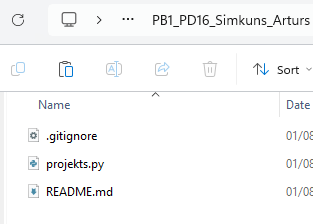
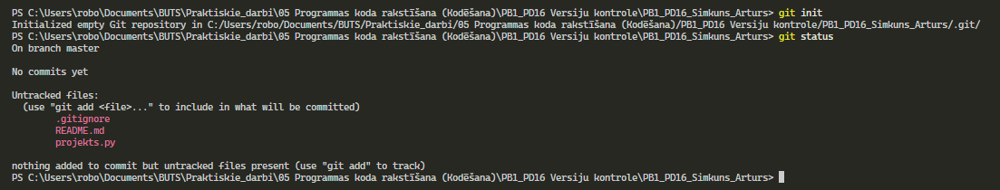
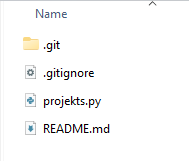
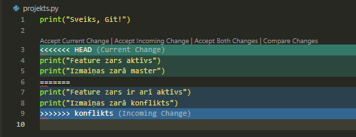
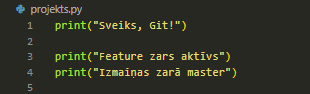
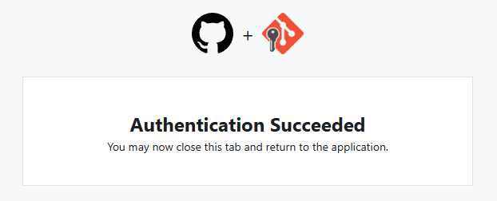
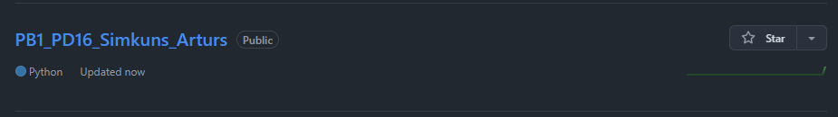
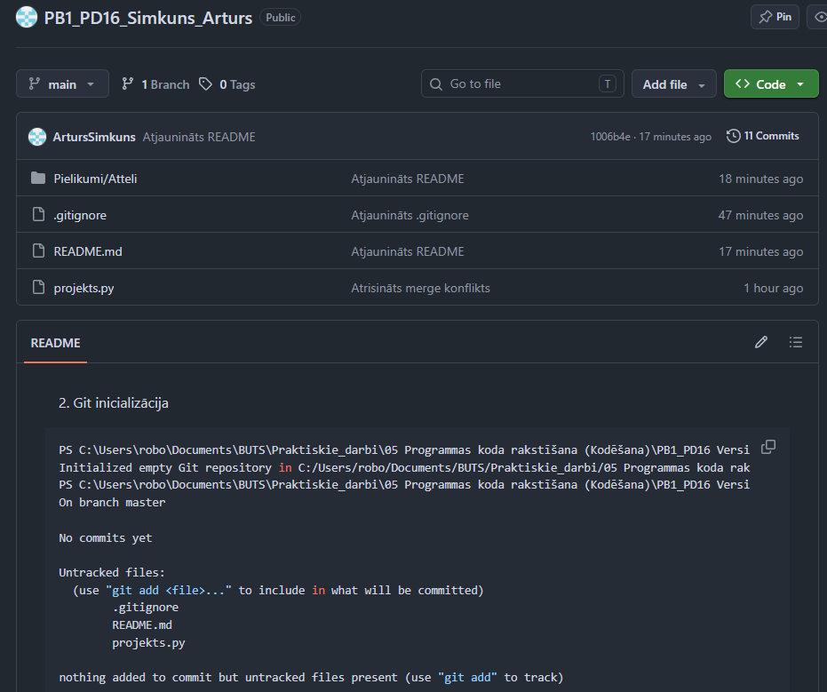

# Praktiskā darba atskaite

---

## 1. Vispārīgā informācija

- Vārds, Uzvārds: Artūrs Šimkūns
- Grupa: PIN_77151_31.03.2026.-09.04.2027.
- Praktiskā darba kods: PB1_PD16
- Datums: 2026-08-01

---

## 2. Darba mērķis

Praktiskā darba mērķis bija apgūt Git versiju kontroles pamatus reālā projekta darbplūsmā: inicializēt lokālu repozitoriju, veidot secīgu commit vēsturi, strādāt ar zariem, veikt merge, izraisīt un manuāli atrisināt konfliktu, konfigurēt `.gitignore`, sagatavot projekta `README.md`, izveidot GitHub repozitoriju un nosūtīt uz to lokālo projekta vēsturi.

Darbs attīstīja prasmi saglabāt loģiskas projekta versijas, droši veikt izmaiņas paralēlā zarā, analizēt Git kļūdu ziņojumus un izmantot GitHub kā attālināto repozitoriju.

---

## 3. Izmantotā vide un rīki

- Operētājsistēma: Windows 11
- Programmas / rīki: Git for Windows, PowerShell, Visual Studio Code, Windows File Explorer, GitHub
- Python versija: Python 3.14.5
- Papildu bibliotēkas: nav izmantotas
- Attālinātais serviss: GitHub
- Repozitorijs: `https://github.com/ArtursSimkuns/PB1_PD16_Simkuns_Arturs`

`projekts.py` ir minimāls statiskas izvades demonstrācijas fails. Fails saglabāts testa nolūkiem, tāpēc tam netika pievienotas funkcijas, docstring vai papildu komentāri.

---

## 4. Uzdevumu izpilde

### 4.1. Projekta struktūras izveide

**Ko darīju:**

Izveidoju mapi `PB1_PD16_Simkuns_Arturs` un tajā trīs uzdevumā prasītos sākotnējos failus: `README.md`, `projekts.py` un `.gitignore`.

**Izmantotās darbības:**

- izveidota projekta mape;
- izveidots Python fails;
- izveidots projekta apraksta fails;
- izveidots Git ignorēšanas noteikumu fails;
- pārbaudīts mapes saturs Windows File Explorer un ar `Show-Tree` palīgkomandu.

**Sākotnējā struktūra:**

```text
PB1_PD16_Simkuns_Arturs/
├── .gitignore
├── projekts.py
└── README.md
```

**Rezultāts:**

Projekta mape un obligātie faili tika izveidoti ar pareiziem nosaukumiem.



*1. attēls. Sākotnējā projekta mape ar `.gitignore`, `projekts.py` un `README.md`.*

---

### 4.2. Git inicializācija

**Ko darīju:**

Atvēru PowerShell projekta mapē, inicializēju Git repozitoriju un pārbaudīju tā statusu.

**Izmantotās komandas:**

```powershell
git init
git status
```

**Faktiskā izvade:**

```text
Initialized empty Git repository in C:/Users/robo/Documents/BUTS/Praktiskie_darbi/05 Programmas koda rakstīšana (Kodēšana)/PB1_PD16 Versiju kontrole/PB1_PD16_Simkuns_Arturs/.git/
On branch master

No commits yet

Untracked files:
  (use "git add <file>..." to include in what will be committed)
        .gitignore
        README.md
        projekts.py

nothing added to commit but untracked files present (use "git add" to track)
```

**Rezultāts:**

Tika izveidota slēptā `.git` direktorija, un `git status` pareizi parādīja trīs neizsekotus failus.



*3. attēls. `git init` un `git status` izvade PowerShell terminālī.*



*4. attēls. Pēc inicializācijas projekta mapē redzama `.git` direktorija.*

---

### 4.3. Git identitātes iestatīšana

**Ko darīju:**

Iestatīju autora vārdu un e-pasta adresi, lai Git varētu piesaistīt commit konkrētam autoram.

**Izmantotās komandas:**

```powershell
git config --global user.name "Artūrs Šimkūns"
git config --global user.email "arturs.simkuns@gmail.com"
git config --list
git config --list --show-origin
```

**Būtiskā pārbaudes izvade:**

```text
user.name=Artūrs Šimkūns
user.email=arturs.simkuns@gmail.com
```

**Rezultāts:**

Git autora identitāte tika iestatīta. Ar `--show-origin` pārbaudīju arī konfigurācijas vērtību avotus.

---

### 4.4. Pirmais commit

**Ko darīju:**

Pievienoju sākotnējos projekta failus staging zonai un izveidoju pirmo repozitorija momentuzņēmumu.

**Izmantotās komandas:**

```powershell
git add .
git commit -m "Pirmais commit: pievienots projekts.py"
```

**Faktiskā izvade:**

```text
[master (root-commit) e46f8b8] Pirmais commit: pievienots projekts.py
 3 files changed, 120 insertions(+)
 create mode 100644 .gitignore
 create mode 100644 README.md
 create mode 100644 projekts.py
```

**Rezultāts:**

Izveidots pirmais commits `e46f8b8`, kas kļuva par projekta vēstures sākumpunktu.

---

### 4.5. Darbs ar zaru `feature-uzlabojums`

**Ko darīju:**

Izveidoju atsevišķu zaru funkcionalitātes uzlabošanai, papildināju `projekts.py` un dokumentāciju un saglabāju izmaiņas commitu vēsturē.

**Izmantotās komandas:**

```powershell
git checkout -b feature-uzlabojums
git add .
git commit -m "Darbs ar zaru feature-uzlabojums"
git add README.md
git commit -m "Atjaunināts README"
```

**Faktiskā izvade:**

```text
Switched to a new branch 'feature-uzlabojums'
[feature-uzlabojums a8a82a7] Darbs ar zaru feature-uzlabojums
 2 files changed, 24 insertions(+), 1 deletion(-)
[feature-uzlabojums 1df6523] Atjaunināts README
 1 file changed, 2 insertions(+)
```

**Rezultāts:**

Tika izveidots atsevišķs zars un tajā saglabāti divi loģiski commiti, neietekmējot galvenā zara sākotnējo stāvokli.

---

### 4.6. Zaru apvienošana

**Ko darīju:**

Pārslēdzos uz galveno zaru un apvienoju tajā `feature-uzlabojums` izmaiņas.

**Sākotnējā problēma:**

Komanda `git checkout main` neizdevās, jo galvenais zars vēl saucās `master`:

```text
error: pathspec 'main' did not match any file(s) known to git
```

Pirmais mēģinājums pārslēgties uz `master` arī tika apturēts, jo `README.md` bija nesaglabātas izmaiņas:

```text
error: Your local changes to the following files would be overwritten by checkout:
        README.md
Please commit your changes or stash them before you switch branches.
Aborting
```

**Risinājums un komandas:**

```powershell
git add README.md
git commit -m "Atjaunināts README"
git checkout master
git merge feature-uzlabojums
```

**Faktiskā merge izvade:**

```text
Updating e46f8b8..1df6523
Fast-forward
 README.md   | 23 +++++++++++++++++++++++
 projekts.py |  4 +++-
 2 files changed, 26 insertions(+), 1 deletion(-)
```

**Rezultāts:**

`feature-uzlabojums` tika veiksmīgi apvienots ar galveno zaru, izmantojot `fast-forward` apvienošanu.

---

### 4.7. Konflikta simulācija un atrisināšana

**Ko darīju:**

Izveidoju zaru `konflikts`, abos zaros mainīju vienu un to pašu `projekts.py` daļu atšķirīgi un mēģināju zarus apvienot.

**Izmantotās komandas:**

```powershell
git checkout -b konflikts
git checkout konflikts
git add projekts.py
git commit -m "Izmaiņas zarā konflikts"

git checkout master
git add projekts.py
git commit -m "Izmaiņas zarā master"

git merge konflikts
```

**Faktiskā kļūdas izvade:**

```text
Auto-merging projekts.py
CONFLICT (content): Merge conflict in projekts.py
Automatic merge failed; fix conflicts and then commit the result.
```

**Konflikta saturs:**

```python
<<<<<<< HEAD
print("Feature zars aktīvs")
print("Izmaiņas zarā master")
=======
print("Feature zars ir arī aktīvs")
print("Izmaiņas zarā konflikts")
>>>>>>> konflikts
```



*5. attēls. VS Code parāda konflikta marķierus un abu zaru atšķirīgos variantus.*

**Risinājums:**

Manuāli izdzēsu `<<<<<<<`, `=======` un `>>>>>>>` marķierus, izvēlējos gala saturu, saglabāju failu un pabeidzu merge:

```powershell
git add projekts.py
git commit -m "Atrisināts merge konflikts"
```

**Rezultāts:**

Tika izveidots merge commits `f27e71e`, un failā vairs nebija konflikta marķieru.



*6. attēls. `projekts.py` gala saturs pēc konflikta manuālas atrisināšanas.*

---

### 4.8. `.gitignore` izveide un pārbaude

**Ko darīju:**

Papildināju `.gitignore` ar biežāk ignorējamiem Python, VS Code, žurnālu un pagaidu failiem. Izveidoju `kludas.log`, lai pārbaudītu noteikuma `*.log` darbību.

**`.gitignore` saturs:**

```gitignore
# Python kešatmiņa
__pycache__/

# Kompilētie Python faili
*.pyc

# VS Code iestatījumi
.vscode/

# Žurnālfaili
*.log

# Pagaidu faili
*.tmp
```

**Izmantotās komandas:**

```powershell
git add .gitignore
git commit -m "Atjaunināts .gitignore"
git check-ignore -v kludas.log
```

**Faktiskā pārbaudes izvade:**

```text
.gitignore:11:*.log    kludas.log
```

**Rezultāts:**

`kludas.log` tiek ignorēts un nav Git izsekoto failu sarakstā. Tas apliecina, ka `.gitignore` darbojas paredzētajā veidā.

---

### 4.9. GitHub repozitorija izveide

**Ko darīju:**

GitHub vietnē izveidoju jaunu publisku repozitoriju `PB1_PD16_Simkuns_Arturs`. Neizvēlējos automātisku README, `.gitignore` vai licences izveidi, jo lokālajā repozitorijā šie faili un commit vēsture jau pastāvēja.


*7. attēls. GitHub repozitoriju skatā izvēlēta poga `New`.*


*8. attēls. Repozitorija nosaukums, publiska pieejamība un sākotnējo failu neizveidošana.*


*9. attēls. GitHub parāda HTTPS adresi un komandas esoša lokāla repozitorija pieslēgšanai.*

**Rezultāts:**

GitHub tika izveidots tukšs publisks repozitorijs, kas bija gatavs lokālās Git vēstures saņemšanai.

---

### 4.10. Lokālā repozitorija pieslēgšana GitHub un push

**Ko darīju:**

Pārdēvēju galveno zaru no `master` uz `main`, pievienoju attālināto repozitoriju ar nosaukumu `origin`, pārbaudīju adresi un nosūtīju lokālo vēsturi uz GitHub.

**Izmantotās komandas:**

```powershell
git branch -M main
git remote add origin https://github.com/ArtursSimkuns/PB1_PD16_Simkuns_Arturs.git
git remote -v
git push -u origin main
```

**Attālinātā repozitorija pārbaude:**

```text
origin  https://github.com/ArtursSimkuns/PB1_PD16_Simkuns_Arturs.git (fetch)
origin  https://github.com/ArtursSimkuns/PB1_PD16_Simkuns_Arturs.git (push)
```

Pirmajā push reizē Git Credential Manager pieprasīja autentifikāciju pārlūkā.



*10. attēls. GitHub un Git Credential Manager autentifikācija pabeigta veiksmīgi.*

**Faktiskā push izvade:**

```text
info: please complete authentication in your browser...
Enumerating objects: 41, done.
Counting objects: 100% (41/41), done.
Delta compression using up to 16 threads
Compressing objects: 100% (38/38), done.
Writing objects: 100% (41/41), 158.25 KiB | 22.61 MiB/s, done.
Total 41 (delta 13), reused 0 (delta 0), pack-reused 0 (from 0)
remote: Resolving deltas: 100% (13/13), done.
To https://github.com/ArtursSimkuns/PB1_PD16_Simkuns_Arturs.git
 * [new branch]      main -> main
branch 'main' set up to track 'origin/main'.
```



*11. attēls. Publiskais repozitorijs pēc veiksmīga push ir redzams GitHub kontā.*



*12. attēls. GitHub repozitorijā redzams `main` zars, projekta faili, commiti un README priekšskatījums.*

**Rezultāts:**

Lokālais `main` tika sasaistīts ar `origin/main`, un projekta Git vēsture kļuva pieejama GitHub.

---

### 4.11. Commit vēstures un zaru pārbaude

**Ko darīju:**

Pārbaudīju visu zaru grafisko commit vēsturi.

**Izmantotā komanda:**

```powershell
git log --oneline --graph --all --decorate
```

**Faktiskā izvade:**

```text
* 6612e53 (HEAD -> main, origin/main) Pievienoti attēli
* 85471ae Atjaunināts README
* cb1e317 Atjaunināts README
* 1006b4e Atjaunināts README
* 8d0d00e Atjaunināts README
* 150174c Atjaunināts README
* 3826796 Atjaunināts .gitignore
* c35e4aa Atjaunināts README
*   f27e71e Atrisināts merge konflikts
|\
| * 1316b02 (konflikts) Izmaiņas zarā konflikts
* | 758654d Izmaiņas zarā master
|/
* 1df6523 (feature-uzlabojums) Atjaunināts README
* a8a82a7 Darbs ar zaru feature-uzlabojums
* e46f8b8 Pirmais commit: pievienots projekts.py
```

**Rezultāts:**

Repozitorijā ir 14 unikāli commiti un trīs lokālie zari: `main`, `feature-uzlabojums` un `konflikts`. Grafā redzams zaru atdalījums un merge commits `f27e71e`.

---

### 4.12. Programmas izpildes pārbaude

**Ko darīju:**

Palaidu gala `projekts.py` failu ar Python.

**Izmantotā komanda:**

```powershell
python projekts.py
```

**Faktiskā izvade:**

```text
Sveiks, Git!
Feature zars aktīvs
Izmaiņas zarā master
```

**Rezultāts:**

Programma izpildījās bez kļūdām un izvadīja trīs paredzētās teksta rindas.

---

## 5. Problēmas un to risinājumi

### 5.1. Galvenā zara nosaukuma neatbilstība

- Problēmas apraksts: uzdevuma komandās tika izmantots `main`, bet Git sākotnēji izveidoja `master`.
- Kļūdas ziņojums:

```text
error: pathspec 'main' did not match any file(s) known to git
```

- Risinājums: sākotnēji pārslēdzos uz `master`, bet pirms GitHub pieslēgšanas zaru pārdēvēju ar `git branch -M main`.
- Ko no tā iemācījos: zara nosaukumu nevar pieņemt bez pārbaudes; pirms pārslēgšanās jāizmanto `git branch`.

### 5.2. Pārslēgšanos bloķēja nesaglabātas izmaiņas

- Problēmas apraksts: Git neļāva pārslēgties no `feature-uzlabojums` uz `master`, jo `README.md` bija necommitotas izmaiņas.
- Kļūdas ziņojums:

```text
error: Your local changes to the following files would be overwritten by checkout:
        README.md
Please commit your changes or stash them before you switch branches.
Aborting
```

- Risinājums: izmaiņas pievienoju staging zonai un izveidoju commit `Atjaunināts README`.
- Ko no tā iemācījos: pirms zara maiņas jāpārbauda `git status` un jāizlemj, vai izmaiņas commitot, atlikt ar `stash` vai atsaukt.

### 5.3. Pirmais konflikta mēģinājums neizdevās

- Problēmas apraksts: sākotnēji `git merge konflikts` atbildēja `Already up to date`, jo izmaiņas nebija izveidotas kā atsevišķi commiti abos zaros.
- Risinājums: katrā zarā atsevišķi izmainīju to pašu rindu, veicu commit un tikai tad atkārtoju merge.
- Ko no tā iemācījos: merge konfliktu rada savstarpēji konkurējoši commitoti labojumi, nevis tikai darba mapē nesaglabātas izmaiņas.

### 5.4. Manuāls merge konflikts

- Problēmas apraksts: Git nevarēja automātiski izvēlēties vienu no diviem atšķirīgiem vienas rindas variantiem.
- Kļūdas ziņojums:

```text
CONFLICT (content): Merge conflict in projekts.py
Automatic merge failed; fix conflicts and then commit the result.
```

- Risinājums: VS Code redaktorā salīdzināju abus variantus, izdzēsu konflikta marķierus, saglabāju izvēlēto saturu un pabeidzu merge ar `git add` un `git commit`.
- Ko no tā iemācījos: Git norāda konflikta vietu, bet gala loģisko risinājumu jāpieņem izstrādātājam.

---

## 6. Secinājumi un refleksija

### 6.1. Ko jaunu iemācījos šajā darbā?

Iemācījos, ka Git nav tikai failu rezerves kopēšana. Tas glabā secīgus projekta momentuzņēmumus, ļauj izsekot izmaiņu vēsturei, droši veidot paralēlus zarus un pēc vajadzības apvienot tos. Sapratu arī atšķirību starp Git kā lokālu versiju kontroles sistēmu un GitHub kā attālinātu repozitorija glabāšanas un sadarbības servisu.

### 6.2. Kā mainījās mana izpratne par versiju kontroli?

Pirms darba versiju kontroli varēja uztvert kā gatavu failu variantu saglabāšanu. Pēc praktiskā darba saprotu, ka profesionāla darbplūsma balstās uz vienu projekta kopiju, maziem loģiskiem commitiem, jēgpilniem commit ziņojumiem un zariem. Vecākas versijas nav jākopē ar nosaukumiem `final_v2` vai `GATAVS`, jo tās saglabā Git vēsture.

### 6.3. Kurš Git solis bija grūtākais?

Grūtākais bija pareizi izraisīt un atrisināt merge konfliktu. Pirmais mēģinājums neizdevās, jo izmaiņas nebija commitotas abos zaros. Pēc darbplūsmas precizēšanas konflikts tika izraisīts, un bija jāizprot `HEAD`, ienākošā zara saturs un konflikta marķieri.

### 6.4. Kas izdevās vislabāk?

Vislabāk izdevās saglabāt pilnu commit vēsturi, izveidot vairākus zarus, dokumentēt reālos termināļa rezultātus un nosūtīt repozitoriju uz GitHub. Gala vēstures grafā skaidri redzams konflikta zars un merge commits.

### 6.5. Kuru IDE izvēlētos darbam ar Git un kāpēc?

Izvēlētos Visual Studio Code, jo tajā vienuviet ir koda redaktors, integrēts terminālis, Source Control skats, failu atšķirību salīdzināšana un ērti merge konflikta risināšanas rīki. Konflikta laikā VS Code skaidri parādīja pašreizējās un ienākošās izmaiņas.

### 6.6. Ko darītu citādi nākamreiz?

Nākamreiz jau darba sākumā iestatītu noklusējuma zaru `main`, pirms katras zara maiņas izpildītu `git status`, un veidotu konkrētākus README commit ziņojumus, piemēram, `Pievienots GitHub push apraksts`, nevis vairākus vienādus `Atjaunināts README` commitus.

---

## 7. Pašvērtējums

| Kritērijs | Maks. punkti | Mani punkti |
|---|---:|---:|
| Git inicializācija | 10 | 10 |
| Commit vēsture | 20 | 20 |
| Branch darbs | 15 | 15 |
| Merge | 15 | 15 |
| Konflikta risinājums | 15 | 15 |
| GitHub integrācija | 15 | 15 |
| README kvalitāte | 10 | 10 |
| **Kopā** | **100** | **100** |

**Pamatojums:**

Repozitorijs ir inicializēts, tajā ir 14 commiti, izveidoti papildu zari, veikta zaru apvienošana, izraisīts un atrisināts konflikts, izveidots `.gitignore`, sagatavots detalizēts README un projekts veiksmīgi nosūtīts uz GitHub. Darba gaita ir dokumentēta ar reālām komandām, faktisko izvadi un ekrānattēliem.

---

## 8. Pielikumi

- `README.md` - projekta apraksts, lietošanas norādes, Git darbplūsma un attēlu apraksti.
- `projekts.py` - Git zaru un konflikta uzdevumā izmantotais Python fails.
- `.gitignore` - ignorējamo Python, VS Code, žurnālu un pagaidu failu noteikumi.
- `kludas.log` - `.gitignore` pārbaudes fails; Git to ignorē.
- `.git/` - sākotnējā Git repozitorija vēsture un konfigurācija; atskaites sagatavošanas laikā nav mainīta.
- `Pielikumi/Atteli/attels01.png` - sākotnējā projekta mape ar trim obligātajiem failiem.
- `Pielikumi/Atteli/attels02.png` - `git init` un `git status` termināļa izvade.
- `Pielikumi/Atteli/attels03.png` - pēc inicializācijas redzamā `.git` direktorija.
- `Pielikumi/Atteli/attels05.png` - merge konflikta marķieri VS Code.
- `Pielikumi/Atteli/attels06.png` - `projekts.py` pēc konflikta atrisināšanas.
- `Pielikumi/Atteli/attels1.png` - GitHub poga jauna repozitorija izveidei.
- `Pielikumi/Atteli/attels2.png` - jaunā GitHub repozitorija iestatījumi.
- `Pielikumi/Atteli/attels3.png` - tukšā repozitorija `Quick setup` lapa un HTTPS URL.
- `Pielikumi/Atteli/attels4.png` - veiksmīga GitHub autentifikācija.
- `Pielikumi/Atteli/attels5.png` - repozitorijs GitHub konta sarakstā.
- `Pielikumi/Atteli/attels6.png` - GitHub repozitorija failu saraksts un README priekšskatījums.

---


